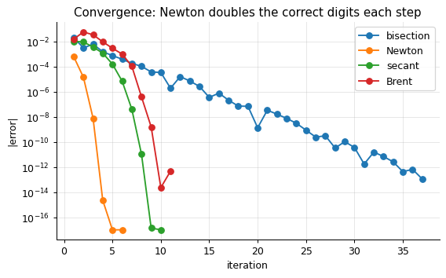
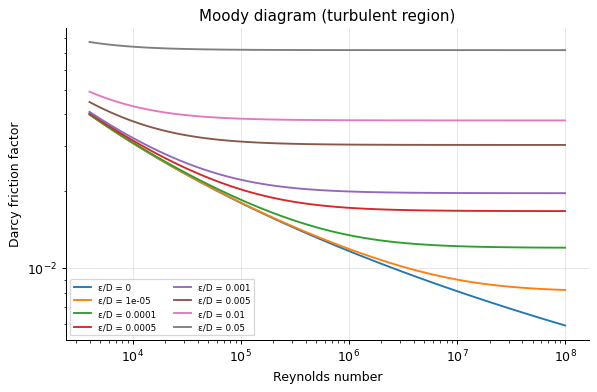
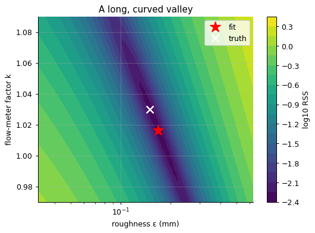
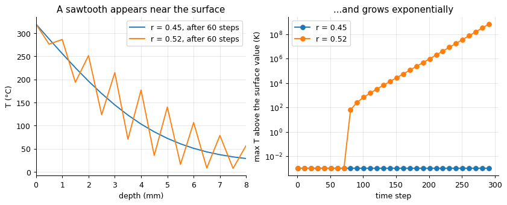
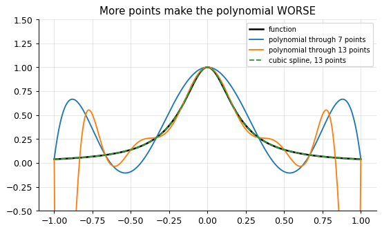
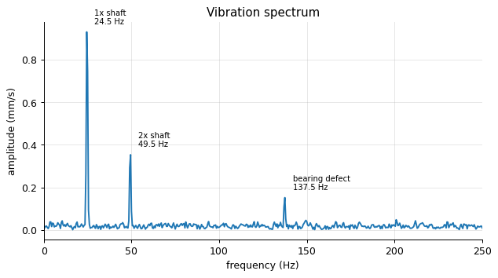
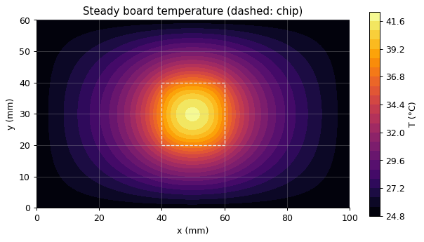

<div align="center">

# engmath

**Engineering mathematics with Python - numerical methods you can read, run and trust.**

[](https://github.com/ktwyw/engmath/actions/workflows/tests.yml)
[](docs/VALIDATION.md)
[](notebooks)
[](pyproject.toml)
[](LICENSE)



</div>

`engmath` teaches the numerical and symbolic methods engineers use every day - root finding, linear and
nonlinear systems, interpolation, integration, differentiation, smoothing, curve fitting, ODEs,
boundary-value problems, PDEs, Fourier analysis, optimisation and linear programming, Monte Carlo
simulation, sparse matrices and symbolic mathematics with SymPy - in two complementary ways:

- **A small library of readable, from-scratch implementations.** Each method is a few dozen lines of
  plain NumPy that you can read like a textbook: Newton's method, natural cubic splines via the Thomas
  algorithm, Savitzky-Golay filters, Levenberg-Marquardt, adaptive Runge-Kutta, Crank-Nicolson.
- **A course of 21 Jupyter notebooks** (about 21 hours of study), with **worked solutions to all 83
  exercises** in [`solutions/`](solutions). Each notebook states its learning
  objectives, prerequisites and time; opens up the algorithm in a few lines of plain Python checked
  against the library; and ends with exercises, including an "implement it yourself" task. The
  problems are original engineering ones: pipe friction and
  the Moody diagram, particle settling, heat conduction with generation, vibration modes, steam-table
  interpolation, energy from logged power data, identifying a cooling law, peak detection, thermocouple
  calibration, Antoine-equation fitting, pipe roughness from pressure drops, batch-reactor optimisation,
  heat penetration, cantilever deflection, a three-reservoir network, fin heat transfer, machine-vibration
  diagnosis, production planning, tank design, structural failure probability and a heated circuit board.

Every algorithm is **validated** against SciPy/NumPy, exact analytic solutions, NIST certified values
and its theoretical order of convergence - 106 checks in [`docs/VALIDATION.md`](docs/VALIDATION.md),
rerun on every push.

## Start learning

| # | Notebook | Engineering problem | Numerical ideas |
|---|---|---|---|
| 00 | [Python & NumPy primer](notebooks/00_python_numpy_primer.ipynb) | laminar pipe flow rate | arrays, vectorisation, functions, plots |
| 01 | [Errors & uncertainty](notebooks/01_errors_and_uncertainty.ipynb) | pump efficiency | round-off, truncation, propagation, Monte Carlo, significant figures |
| 02 | [Root finding](notebooks/02_root_finding.ipynb) | Colebrook friction factor, sand settling | bisection, Newton, secant, Brent, convergence order |
| 03 | [Linear systems](notebooks/03_linear_systems.ipynb) | heated wall, 2D plate, vibrating chain | Gauss, Thomas, Gauss-Seidel, eigenvalues |
| 04 | [Interpolation](notebooks/04_interpolation.ipynb) | vapour-pressure table | linear, splines, transforming data, Runge's phenomenon |
| 05 | [Integration](notebooks/05_integration.ipynb) | machine energy use, tank filling | trapezoid, Simpson, Romberg, Gauss-Legendre |
| 06 | [Differentiation](notebooks/06_differentiation.ipynb) | cooling law of a forging | uneven-grid derivatives, noise amplification |
| 07 | [Smoothing](notebooks/07_smoothing.ipynb) | overlapping detector peaks | moving average, Savitzky-Golay, LOWESS |
| 08 | [Linear least squares](notebooks/08_linear_regression.ipynb) | thermocouple calibration | QR vs normal equations, residuals, robust fitting |
| 09 | [Nonlinear regression](notebooks/09_nonlinear_regression.ipynb) | Antoine equation | Levenberg-Marquardt, parameter correlation, starting values |
| 10 | [Implicit models](notebooks/10_implicit_models_optimisation.ipynb) | pipe roughness from pressure drops | root finding inside fitting, golden section, Nelder-Mead |
| 11 | [ODEs](notebooks/11_odes.ipynb) | batch reactor A → B → C | Euler, RK4, adaptive steps, stiffness |
| 12 | [PDEs](notebooks/12_diffusion_pde.ipynb) | heat penetration into steel | FTCS stability, Crank-Nicolson, inverse problems |
| 13 | [Symbolic maths (SymPy)](notebooks/13_symbolic_sympy.ipynb) | cantilever deflection | derivations, error terms of numerical methods, `lambdify`, Jacobians |
| 14 | [Nonlinear systems](notebooks/14_nonlinear_systems.ipynb) | three-reservoir pipe network | Newton for systems, line search, basins of attraction |
| 15 | [Boundary-value problems](notebooks/15_boundary_value_problems.ipynb) | pin fin, radiating fin | shooting, finite differences, Robin conditions, nonlinear BVPs |
| 16 | [Fourier analysis](notebooks/16_fourier_analysis.ipynb) | vibration diagnosis of a pump | DFT, FFT, windowing, resolution, aliasing, filtering |
| 17 | [Constrained optimisation & LP](notebooks/17_optimisation_constraints_lp.ipynb) | production planning, tank design | simplex method, shadow prices, penalty method, formulation pitfalls |
| 18 | [Monte Carlo](notebooks/18_monte_carlo.ipynb) | high-dimensional integrals, diffusion, failure probability | 1/√N law, random walks, rare events |
| 19 | [Sparse matrices & 2D PDEs](notebooks/19_sparse_2d_pdes.ipynb) | chip heating a circuit board | 5-point Laplacian, Kronecker products, CG, transient implicit solves |
| 20 | [Working with data files](notebooks/20_working_with_data_files.ipynb) | real NIST and Mauna Loa CO₂ data, a messy logger file | reading, inspecting and cleaning files; trend and seasonal analysis |

## Real data included

`engmath.datasets` ships data files to practise on - read them with NumPy or pandas exactly as you would
read your own:

| File | Content |
|---|---|
| `Chwirut2.dat`, `Hahn1.dat`, `ENSO.dat` | **real** NIST reference measurements (ultrasonic calibration, thermal expansion of copper, Pacific pressure record) with certified results - public domain |
| `co2_mauna_loa_monthly.csv` | **real** monthly CO₂ at Mauna Loa, 1958-2026 (NOAA, public-domain dedication), kept unchanged including its header quirk |
| `thermocouple_calibration.csv`, `pipe_pressure_drop.csv`, `thermocouple_10mm.csv`, `pump_vibration.csv` | course measurement data (synthetic, generated by `tools/make_course_data.py`) |
| `process_log_messy.csv` | a deliberately messy data-logger file (unit change, gap, duplicates, error codes, spikes) |

```python
from engmath import datasets
import numpy as np
data = np.loadtxt(datasets.path("Chwirut2.dat"), skiprows=60)
print(datasets.info("co2_mauna_loa_monthly.csv"))
```

See the [notebook guide](notebooks/README.md) for times, prerequisites and suggested paths. Open any
notebook on GitHub to read it with all results and figures, or run it:

```bash
git clone https://github.com/ktwyw/engmath && cd engmath
pip install -e ".[notebooks]"
jupyter lab notebooks/
```

or open it in **Google Colab** (`https://colab.research.google.com/github/ktwyw/engmath/blob/main/notebooks/<name>.ipynb`)
- the first cell installs `engmath` automatically.

## Use the library

```python
import numpy as np
from engmath import roots, interpolate, integrate, fitting, odes, reporting

roots.newton(lambda x: x**3 - 2*x - 5, 2.0)            # RootResult with iteration history
s = interpolate.CubicSpline(T_table, p_table); s(35.4)  # natural cubic spline
integrate.simpson(power, time)                          # works for unevenly spaced data
fit = fitting.levenberg_marquardt(model, x, y, p0)      # coefficients, SEs, correlation, history
t, y = odes.rk23(rhs, y0, 0, 10, rtol=1e-6)             # adaptive Runge-Kutta
reporting.format_uncertainty(2.29987, 0.08907)          # '2.30 ± 0.09'
```

| Module | Methods |
|---|---|
| `roots` | bisection, Newton-Raphson, secant, Brent; observed convergence order |
| `optimize` | golden-section search, Nelder-Mead simplex |
| `linalg` | Gaussian elimination with pivoting, Thomas algorithm, Jacobi/Gauss-Seidel, power iteration |
| `interpolate` | linear (no silent extrapolation), natural cubic spline, Lagrange polynomial |
| `integrate` | trapezoid, cumulative trapezoid, Simpson (uneven spacing), Romberg, Gauss-Legendre |
| `differentiate` | forward/central differences, 3-point gradient for uneven data, second derivative, Richardson |
| `smoothing` | moving average, Savitzky-Golay (with derivatives), LOWESS (robust option) |
| `fitting` | QR least squares with standard errors, Huber robust regression, Levenberg-Marquardt |
| `odes` | Euler, RK4, adaptive Bogacki-Shampine RK23, backward Euler for stiff systems |
| `pdes` | 1D diffusion: explicit FTCS (with stability check), Crank-Nicolson |
| `reporting` | value ± uncertainty with correct significant figures; first-order error propagation |
| `nonlinear` | Newton's method for systems with numerical or supplied Jacobian and backtracking line search |
| `bvp` | shooting method; finite differences for linear BVPs with Dirichlet and Robin (ghost-node) conditions |
| `fourier` | DFT from the definition, radix-2 FFT from scratch, amplitude spectra with Hann window, FFT filtering |
| `optimize` (also) | simplex linear programming with shadow prices; quadratic penalty method |
| `montecarlo` | Monte Carlo integration with standard errors; lattice random walks |
| `sparse` | sparse 1D/2D Laplacians via Kronecker products, 2D Poisson solver, conjugate gradient |
| `datasets` | paths, sources and licences of the bundled data files |

SymPy is used in the notebooks (optional dependency: `pip install "engmath[notebooks]"`).

The library is for learning and for small, transparent calculations. For production work use SciPy -
the notebooks always show the equivalent SciPy call and compare the two.

## Gallery

| | |
|:-:|:-:|
| <br>Moody diagram from a root finder | <br>Two correlated parameters: a long valley |
| <br>Why explicit schemes need small steps | <br>Runge's phenomenon: more points, worse fit |
| <br>A bearing defect found in a vibration spectrum | <br>53,521 unknowns: a chip heating a circuit board |

## Validation

`python docs/validate.py` checks, among others: roots against `scipy.optimize.brentq` and observed
orders (Newton 2, secant 1.618); Gauss elimination, Thomas and iterative solvers against
`numpy.linalg.solve`; the natural spline, its derivative and integral against `scipy.interpolate`;
observed orders of the trapezoid (2), Simpson (4), Euler (1) and RK4 (4); Savitzky-Golay against
`scipy.signal.savgol_filter`; Huber regression against statsmodels; Levenberg-Marquardt against the
NIST StRD Misra1a certified values; RK4 against `solve_ivp`; FTCS and Crank-Nicolson against the exact
erfc solution; Newton for systems against an independent one-equation reduction and `scipy.optimize.root`;
shooting and finite differences against the exact fin solution (observed order 2); the FFT against
`numpy.fft`; the simplex method (optimum and shadow prices) against `scipy.optimize.linprog`; the penalty
method against SLSQP and the analytic optimum; Monte Carlo against exact n-ball volumes and random-walk
theory; the sparse Poisson solver against manufactured solutions; Levenberg-Marquardt against NIST's
certified results for the real Chwirut2 and ENSO datasets, read from the bundled files; and the reporting rules.

## Related

For engineering **statistics** - confidence and tolerance intervals, hypothesis tests, design of
experiments, control charts, reliability, gauge R&R - see the companion library
[engstat](https://github.com/ktwyw/engstat). For fluid mechanics, see
[fluidmech](https://github.com/ktwyw/fluidmech).

## Author

**Yanwei Wang** - personal open-source project.
[GitHub @ktwyw](https://github.com/ktwyw) · [ORCID 0000-0002-8488-9833](https://orcid.org/0000-0002-8488-9833) ·
wangyanwei@gmail.com

## License

MIT - see [LICENSE](LICENSE). Contributions welcome: see [CONTRIBUTING.md](CONTRIBUTING.md).
